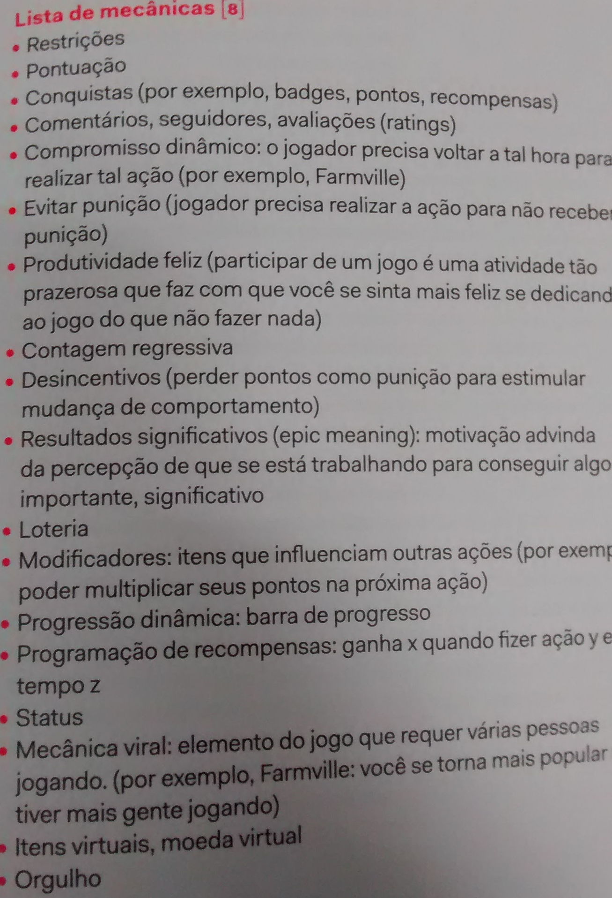
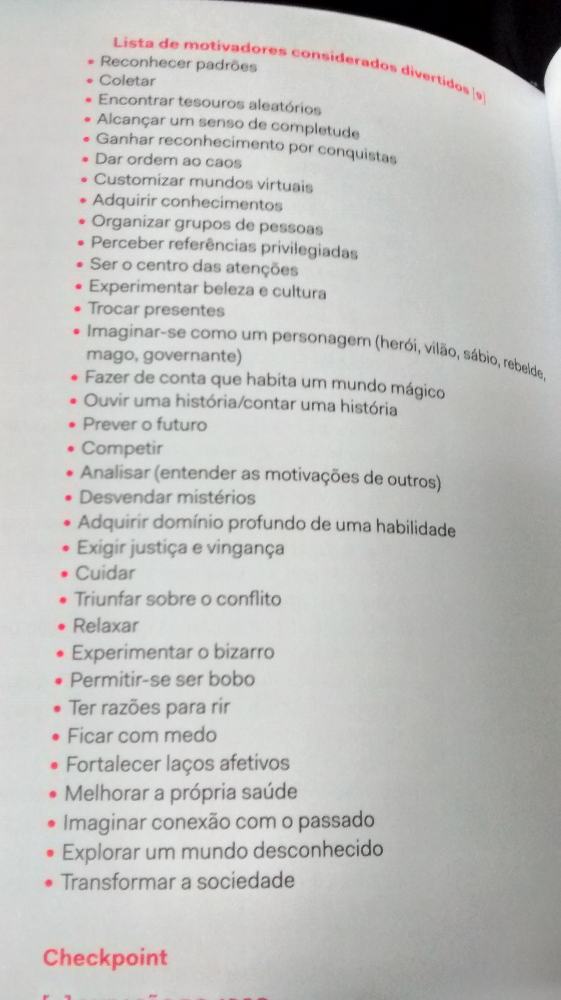

Vianna, Y., Vianna, M., Medina, B., & Tanaka, S. (2013). Gamification, Inc: como reinventar empresas a partir de jogos.

"No caso dos seres humanos ancestrais, uma das principais maneiras de conseguir alimento basicamente consistia em atirar objetos que estivessem à mão na direção do que lhes apetecia. Deve ser por isso que até hoje adoramos jogar coisas: pedras no mar, lanças, martelos, bolas de basquete, vôlei, golfe, etc." (p. 15)

"Sendo assim, é compreensível que tenhamos criado jogos, visto que eles saciam de modo mais simples, rápido, claro e eficiente essa constante busca que nos assola por conquistar ou cumprir objetivos" (p. 17)

> "... todos os jogos compartilham quatro características que os definem: meta, regras, sistema de feedback e participação voluntária." (p. 28)
(McGonical, Jane. A realidade em jogo: poeque os games nos tornam melhores e como eles podem udar o mundo. Rio de Janeiro: Best Seller, 2012.)

|Jogos vs. Trabalho   	| No jogo  							|No trabalho   							|
|---	                |---								|---									|
|Tarefas 			  	|Repetitivas, mas divertidas   		|Repetitivas e maçantaes  				|
|Feedback   			|Constante		   					|Uma vez ao ano   						|
|Objetivos   			|Bem definidos   					|Vagos ou contraditórios   				|
|Evolução Pessoal   	|Clara e tangível   				|Obscura   								|
|Regras   				|Transparentes   					|Pouco transparentes   					|
|Informações   			|Adequada à necessidade do momento  |Em demasia e ainda assim insuficientes	|
|Status   				|Bastante visível   				|Pouco ou nada visível   				|
|Promoção   			|Meritocracia   					|Critérios subjetivos   				|
|Colaboração   			|Presente   						|Presente   							|
|Risco   				|Alto   							|Baixo   								|
|Autonomia   			|Alta   							|De mediana para baixa   				|
|Narrativa   			|Sempre presente   					|Raramente presente   					|
|Obstáculos   			|Propositais   						|Acidentais   							|
(p. 48)

_Checar jogo: Planning Poker_ (p. 61)

(p. 99), baseado em [SCVNGR Game Mechanics](https://techcrunch.com/2010/08/25/scvngr-game-mechanics/)

(p. 100), baseado em:
Radoff, J. (2011). *Game on: energize your business with social media games*. John Wiley & Sons.